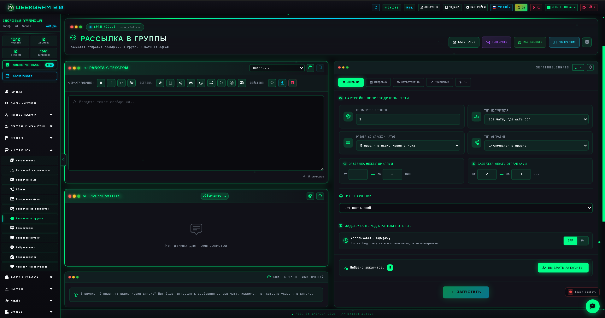
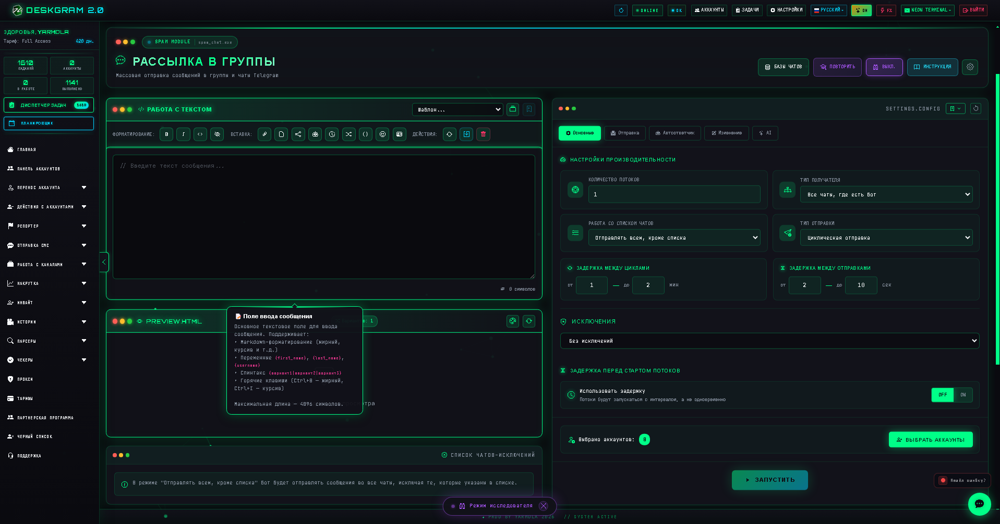
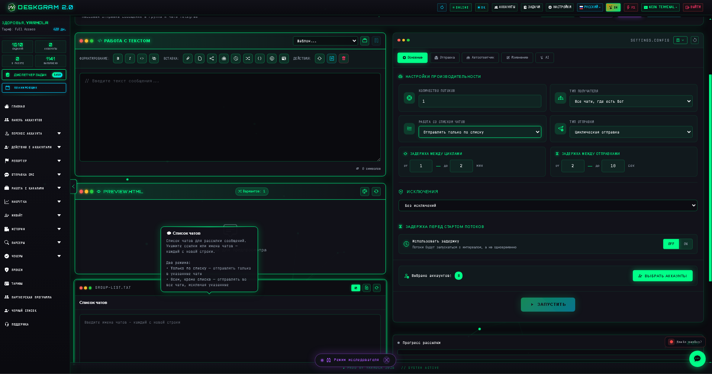
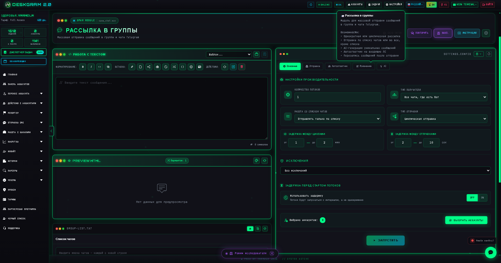

# Массовые сообщения в Telegram-чаты через Deskgram 2

Модуль массовых сообщений по Telegram-чатам в Deskgram 2 помогает отправлять подготовленные сообщения в существующие чаты и группы, управлять списками исключений, переключать режимы работы со списками и держать под контролем вкладки производительности, автоответов и AI-настроек. Это полезно, когда рабочая коммуникация строится не через личные сообщения, а через чаты и групповые площадки.

[Главный хаб Deskgram 2](https://github.com/Deskgram-2/deskgram-2-telegram-automation) · [Сайт](https://deskgram2.com/) · [Telegram-бот](https://t.me/DG2welcomebot) · [Web preview](https://deskgram2.com/web-preview?path=%2Fapp-demo%2F&lang=ru)

## Интерактивный Web Preview

Попробовать модуль в браузере: [Открыть веб-превью](https://deskgram2.com/web-preview?path=%2Fapp-demo%2Ffunctions%2Fspam_chat&lang=ru)

Так можно заранее посмотреть конструктор сообщений, списки чатов и вкладки настроек до запуска на реальной сетке аккаунтов.

## Скриншоты

## Кратко о модуле

| Параметр | Что внутри |
|---|---|
| Основная задача | Массовая отправка сообщений в существующие чаты и группы |
| Важные блоки | Конструктор сообщений, список чатов или исключений, вкладки настроек, AI и автоответы |
| Полезен для | Групповых касаний, чатов поддержки, прогрева диалогов и сценариев вокруг сообществ |
| Связанные модули | Рассылка в ЛС, Подписки, Диспетчер задач, Настройки |

## Что умеет модуль

- отправлять сообщения в существующие чаты и группы;
- переключать режимы работы со списками: только список или список исключений;
- управлять производительностью, задержками и вкладками отправки;
- подключать автоответчик и AI-настройки внутри того же маршрута;
- использовать чаты как отдельный execution-слой рядом с личными сообщениями.

## Быстрый старт

1. Соберите текст сообщения в конструкторе.
2. Подготовьте список чатов или список исключений.
3. Настройте производительность, задержки и логику отправки.
4. При необходимости включите автоответы и AI-опции.
5. Запустите модуль и контролируйте результат через статистику и логи.

## Где этот модуль особенно полезен

- [Рассылка в ЛС](https://github.com/Deskgram-2/telegram-direct-messaging-deskgram), если нужна параллельная линия через личные сообщения и чаты;
- [Подписки по ключам и спискам](https://github.com/Deskgram-2/telegram-keyword-subscriptions-deskgram), если сначала нужно подписать аккаунты на площадки, а потом запускать чатовые касания;
- [Прогрев чатов](https://github.com/Deskgram-2/telegram-chat-warmup-deskgram), если перед масштабной отправкой нужно разогреть чатовую сетку;
- [Диспетчер задач](https://github.com/Deskgram-2/telegram-task-manager-deskgram), если чатовые сценарии должны жить в общей операционной панели.

## Что выбрать: сообщения в чаты или рассылку в ЛС

| Если задача такая | Лучше использовать |
|---|---|
| Нужны касания в групповых обсуждениях и чатах | `Сообщения в чаты` |
| Нужен прямой диалог с пользователем в личке | [Рассылка в ЛС](https://github.com/Deskgram-2/telegram-direct-messaging-deskgram) |
| Важен сценарий вокруг существующих сообществ | `Сообщения в чаты` |
| Нужна персональная линия общения | `Рассылка в ЛС` |

## Смежные репозитории

- [Главный хаб Deskgram 2](https://github.com/Deskgram-2/deskgram-2-telegram-automation)
- [Рассылка в ЛС](https://github.com/Deskgram-2/telegram-direct-messaging-deskgram)
- [Подписки по ключам и спискам](https://github.com/Deskgram-2/telegram-keyword-subscriptions-deskgram)
- [Прогрев чатов](https://github.com/Deskgram-2/telegram-chat-warmup-deskgram)
- [Диспетчер задач](https://github.com/Deskgram-2/telegram-task-manager-deskgram)

## FAQ

### Можно ли сначала посмотреть интерфейс до запуска?

Да. В веб-превью уже видны конструктор сообщения, список чатов и основные вкладки настроек.

### Этот модуль дублирует рассылку в ЛС?

Нет. Здесь фокус на групповых чатах и площадках, а не на персональном диалоге с пользователем.
